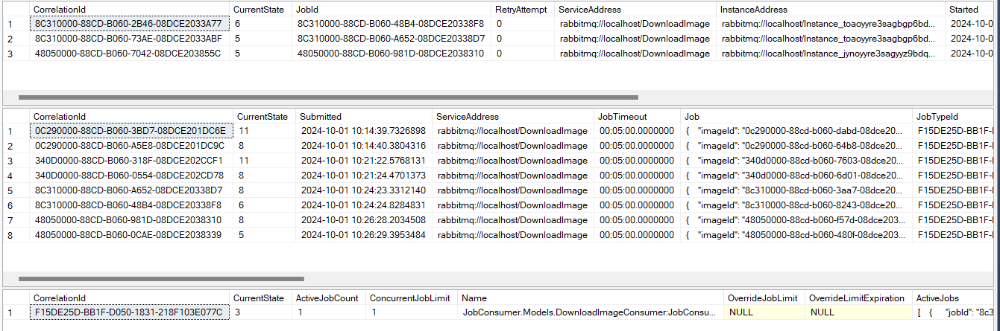

# JobConsumers
Conventional messages get immediately locked by brokers. Job consumers, on the other hand, allows you to decouple messages from the broker(that means all the report about the message state is internally handled by **sagas**).

## How do they work ?
The job consumers are implemented through _IJobConsumer<T>_ and contains one method that has to be overriden called Run(the same as Consume for consumers).
The specific configuration has to be applied in order to track the state of the messages.
```csharp
builder.Services.AddMassTransit(x =>
{
    x.AddJobSagaStateMachines()
         .EntityFrameworkRepository(e =>
         {
              e.ExistingDbContext<ImageStateDbContext>();
         });
}
```

Internally, `AddJobSagaStateMachines()` method adds three saga state machines, each having their own purposes of tracking available job service instances.
```csharp
_jobTypeConfigurator = configurator.AddSagaStateMachine<JobTypeStateMachine, JobTypeSaga, JobTypeSagaDefinition>();
_jobConfigurator = configurator.AddSagaStateMachine<JobStateMachine, JobSaga, JobSagaDefinition>();
_jobAttemptConfigurator = configurator.AddSagaStateMachine<JobAttemptStateMachine, JobAttemptSaga, JobAttemptSagaDefinition>();
```

* JobSaga: Orchestrates each job, including scheduling, retry, and failure handling
* JobAttemptSaga: Orchestrates each job attempt, communicating directly with a specific job service instance
* JobTypeSaga: Keep track of available job instances and allocates job slots to waiting jobs

> Think of job slots as placeholders for active jobs. Once a job is being processed, a slot is "occupied," and it cannot be used for other jobs until the processing of that job is completed.

The DbContext should be configured in order to serve a storage for sagas, as by default, the `InMemoryRepository()` is used which is not durable.
```csharp
public class ImageStateDbContext : SagaDbContext
{
    public ImageStateDbContext(DbContextOptions<ImageStateDbContext> options) : base(options) {}
    public DbSet<Image> Images { get; set; }

    protected override IEnumerable<ISagaClassMap> Configurations
    {
        get
        {
            yield return new JobTypeSagaMap(true);
            yield return new JobSagaMap(true);
            yield return new JobAttemptSagaMap(true);
        }
    }
}
```
And this is how each of the table might look like(1 - JobAttemptSaga, 2 - JobSaga, 3 - JobTypeSaga)



